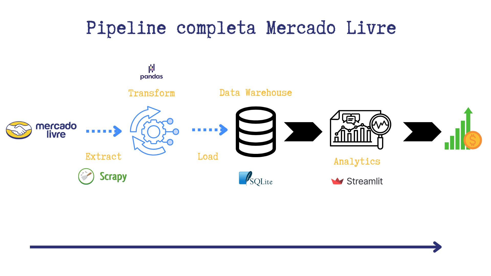

# 🚀 Pipeline de Dados do Mercado Livre - Análise de Relógios Masculinos



## 📋 Sobre o Projeto

Este projeto implementa uma **pipeline de dados completa** para análise de relógios masculinos do Mercado Livre, seguindo as etapas de **ETL (Extract, Transform, Load)**. O sistema coleta dados de produtos, processa as informações e apresenta análises através de um **dashboard interativo**.

### 🛠️ Tecnologias Utilizadas

- **Scrapy**: Web scraping e extração de dados
- **Pandas**: Transformação e manipulação de dados
- **SQLite3**: Armazenamento de dados
- **Streamlit**: Visualização e dashboard interativo

## 🚀 Estrutura do Projeto

```
SCRAPING_RELOGIO_MASCULINO/
├── .venv/                      # Ambiente virtual
├── data/                       # Diretório para armazenamento de dados
├── src/
│   ├── coleta/
│   │   ├── spiders/
│   │   │   └── mercadolivre.py # Spider para extração de dados
│   │   ├── items.py
│   │   ├── middlewares.py
│   │   ├── pipelines.py
│   │   └── settings.py
│   ├── dashboard/
│   │   └── app.py              # Interface do dashboard
│   └── transform/
│       └── main.py             # Transformação e carga dos dados
├── .gitignore
├── .python-version
├── Pipeline.jpg
└── README.md
```

## 💻 Funcionalidades

### 1. Extração de Dados (Extract)
- 🔍 Coleta automatizada de dados de relógios masculinos do Mercado Livre
- 📦 Extração de informações como preços, avaliações, marcas e categoria
- 💾 Armazenamento inicial em formato JSONL

### 2. Transformação (Transform)
- 🧹 Limpeza e padronização dos dados
- 🔄 Tratamento de valores nulos
- 📊 Conversão de tipos de dados
- 💰 Cálculos de preços totais

### 3. Carga (Load)
- 🗄️ Armazenamento em banco de dados SQLite
- ⚡ Estruturação otimizada para consultas

### 4. Visualização (Dashboard)
- 📈 KPIs principais do negócio
- 🏆 Rankings de produtos e marcas
- 📉 Análises de preços e avaliações
- 📊 Gráficos interativos

## 🔧 Como Executar

1. **Extração dos Dados**
   ```bash
   cd src
   scrapy crawl mercadolivre -o ../data/data.jsonl
   ```

2. **Transformação e Carga**
   ```bash
   python transform/main.py
   ```

3. **Iniciar Dashboard**
   ```bash
   streamlit run dashboard/app.py
   ```

## 📊 Visualizações Disponíveis

- 📦 Total de produtos extraídos
- 🏷️ Número de marcas únicas
- 💵 Preços médios (atual e antigo)
- ⭐ Top 10 marcas com mais reviews
- 💰 Produtos com maior e menor preço
- 📈 Média de preços por marca
- 😊 Satisfação por marca

## 📝 Requisitos

```plaintext
scrapy==2.8.0
pandas==1.5.3
streamlit==1.22.0
sqlite3
```

## 🤝 Contribuições

Contribuições são sempre bem-vindas! Sinta-se à vontade para abrir issues ou enviar pull requests.

---

Desenvolvido com ❤️ por [Andrews Goes]
